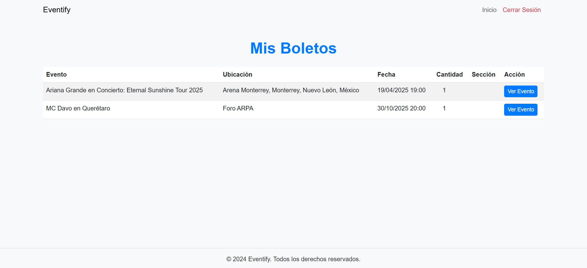

# Eventify

## Descripción del Proyecto

Eventify es una plataforma en línea desarrollada en equipo que permite a los usuarios organizar y asistir a eventos. El sistema incluye la gestión de eventos, boletos, asistentes y comentarios. Es una solución completa que permite a los organizadores personalizar sus eventos y gestionar asistentes mientras que los usuarios pueden comprar boletos, dejar comentarios y puntuar eventos.

## Equipo de Desarrollo

Este proyecto lo desarrollamos en equipo por:

- **Antonio Garza Lozano**:
    - Creación y diseño del backend.
    - Implementación de la lógica de negocios y gestión de eventos.
    - Desarrollo de los controladores y notificaciones.

- **Cristian Romero Luna**:
    - Diseño e integración del frontend.
    - Configuración de las vistas para organizadores y usuarios.
    - Implementación de validaciones y funcionalidad de compra de boletos.

- **Gael Muñoz Valle**:
    - Configuración y gestión de la base de datos.
    - Creación de migraciones, modelos y relaciones.
    - Implementación de pruebas y corrección de errores.


## Tecnologías que utlizamos

- **Frontend**: Bootstrap, Tailwind CSS
- **Backend**: Laravel 11
- **Base de Datos**: MySQL
- **Autenticación y Autorización**: Laravel Breeze
- **Notificaciones**: Laravel Notifications

## Cómo Trabajamos el Proyecto

Este proyecto fue desarrollado en equipo siguiendo los siguientes pasos:

1. **Planificación**:
    - Definimos los requerimientos del sistema.
    - Dividimos las tareas según las fortalezas de cada integrante del equipo.

2. **Desarrollo**:
    - Cada integrante se encargó de diferentes módulos: gestión de eventos, compra de boletos, sistema de comentarios, etc.
    - Utilizamos un repositorio de GitHub para coordinar el trabajo y realizar commits regulares.

3. **Pruebas**:
    - Realizamos pruebas manuales de cada módulo.

4. **Entrega**:
    - Preparamos un entorno limpio para el despliegue.
    - Documentamos cómo configurar y ejecutar el proyecto.

## Requisitos Previos

Para ejecutar este proyecto, necesitas lo siguiente:

- PHP 8.3 o superior
- Composer
- MySQL 8.x
- Node.js y npm 
- Git

## Pasos para Ejecutar el Proyecto

1. **Clona el Repositorio**:
   ```bash
   git clone https://github.com/tu-usuario/Eventify.git
   cd Eventify
   ```

2. **Configura el Entorno**:
    - Crea un archivo `.env` basado en `.env.example`:
      ```bash
      cp .env.example .env
      ```
    - Configura la conexión a la base de datos en el archivo `.env`:
      ```env
      DB_DATABASE=tu_base_de_datos
      DB_USERNAME=tu_usuario
      DB_PASSWORD=tu_contraseña
      ```

3. **Instala las Dependencias**:
   ```bash
   composer install
   npm install
   npm run build
   ```

4. **Genera la Clave de la Aplicación**:
   ```bash
   php artisan key:generate
   ```

5. **Migra y Seed de la Base de Datos**:
   ```bash
   php artisan migrate --seed
   ```

6. **Arranca el Servidor**:
   ```bash
   php artisan serve
   ```

7. **Opcional**: Para enviar correos, asegúrate de configurar los detalles de tu servidor de correo en `.env`.

## Exportar y Importar la Base de Datos

Para compartir los datos de la base de datos:

### Exportar
1. En MySQL Workbench o terminal:
   ```bash
   mysqldump -u tu_usuario -p tu_base_de_datos > database.sql
   ```

2. Agrega el archivo al repositorio:
   ```bash
   mkdir database/dumps
   mv database.sql database/dumps/
   git add database/dumps/database.sql
   git commit -m "Se agrega la base de datos"
   git push origin main
   ```

### Importar
1. Descarga el archivo `database.sql` del repositorio.
2. Importa los datos:
   ```bash
   mysql -u tu_usuario -p tu_base_de_datos < database.sql
   ```

### Para ingresar como organizador puedes usar las siguientes credenciales:

- Correo Electrónico: organizer@example.com
- Contraseña: password123

### Para ingresar como usuario o asistente puedes usar las siguientes credenciales:

- Correo Electrónico: user@example.com
- Contraseña: password123


## Algunas imágenes del proyecto funcionando

- Dashboard con sesión de Organizador.


- Lista de Asistentes.


- Creación y administeación de eventos.


- Envío de correo después de hacer la compra.


- Crear nuevo evento.


- Dashboard Principal


- Vista de Inicio de Sesión


- Vista de Crear una cuenta nueva.


- Vista de Crear una cuenta nueva.


- Dashboard con sesión de Usuario o Asistente.


- Sesión como usuario, puedes revisar los boletos que compraste referente al evento y ver sus detalles.


- Sesión como usuario, puedes revisar los eventos publicados por organizadores.


- Sesión como usuario, puedes ingresar a los eventos, comprar boletos e incluso dejar un comentario sobre el evento.

